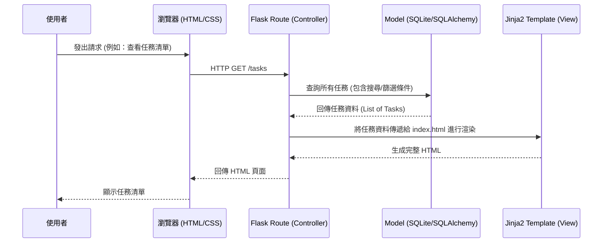

# 任務管理系統 - 系統架構設計 (Architecture)

## 1. 技術架構說明

本專案採用輕量級的 Python Web 框架 Flask，搭配 Jinja2 模板引擎與 SQLite 資料庫。由於專案規模較小且希望快速開發，我們選擇不進行前後端分離，所有頁面由後端統一渲染。

- **後端框架 (Flask)**：輕量、具備高擴充性，適合建立 MVP 與中小型網頁應用程式。
- **模板引擎 (Jinja2)**：與 Flask 整合度極高，能動態將 Python 資料嵌入 HTML 頁面中，負責前端頁面的生成與渲染。
- **資料庫 (SQLite)**：無須安裝額外服務器的關聯式資料庫，儲存在本地單一檔案中，非常適合初期開發與個人專案使用。

### MVC 架構模式說明
系統大致遵循 MVC (Model-View-Controller) 架構模式來分離職責：
- **Model (模型)**：負責定義資料結構與資料庫互動邏輯。例如任務資料表（Task）包含標題、狀態、到期日、標籤等欄位。
- **View (視圖)**：負責呈現使用者介面，這裡指的是 Jinja2 渲染出的 HTML 模板，負責顯示任務清單、新增/編輯表單等。
- **Controller (控制器)**：由 Flask 的路由 (Routes) 扮演，負責接收使用者的 HTTP 請求、呼叫 Model 處理資料，最後將結果傳遞給 View 進行頁面渲染。

## 2. 專案資料夾結構

本系統採用模組化的結構，方便未來擴充與維護。

```text
web_app_development2/
├── app/                      # 應用程式主要邏輯
│   ├── models/               # 資料庫模型 (Models)
│   │   ├── __init__.py
│   │   └── task.py           # 處理 Task 相關資料表與操作
│   ├── routes/               # Flask 路由控制器 (Controllers)
│   │   ├── __init__.py
│   │   └── task_routes.py    # 定義 CRUD、狀態變更、搜尋等 API 與頁面路由
│   ├── templates/            # Jinja2 HTML 模板 (Views)
│   │   ├── base.html         # 共用的版面配置 (導覽列、頁首/頁尾)
│   │   ├── index.html        # 任務列表首頁 (包含搜尋、篩選與清單)
│   │   └── task_form.html    # 新增/編輯任務的表單頁面
│   └── static/               # 靜態資源 (CSS / JS / 圖片)
│       ├── css/
│       │   └── style.css     # 自訂樣式表
│       └── js/
│           └── main.js       # 前端互動邏輯 (如簡易的確認提示等)
├── instance/                 # 系統執行時產生的實例資料 (通常不進入版控)
│   └── database.db           # SQLite 資料庫檔案
├── docs/                     # 專案文件
│   ├── PRD.md                # 產品需求文件
│   └── ARCHITECTURE.md       # 系統架構文件 (本文件)
├── requirements.txt          # Python 依賴套件清單 (Flask, etc.)
└── app.py                    # 專案執行入口 (初始化 Flask app 與註冊藍圖)
```

## 3. 元件關係圖

以下圖示展示了使用者、瀏覽器、Flask 後端與資料庫之間的互動流程：



## 4. 關鍵設計決策

1. **伺服器端渲染 (SSR)**：
   - **決策**：前端畫面由 Flask 透過 Jinja2 渲染產生，而非採用 React/Vue 等前端框架透過 API 拿取資料 (SPA)。
   - **原因**：根據 PRD 要求與專案目標，這樣能夠降低專案複雜度、加速開發時間，且對於基本的 CRUD 任務管理系統已經相當足夠。
2. **單一資料庫實體 (SQLite)**：
   - **決策**：將所有資料 (包含任務、標籤等) 存放在單一個 `database.db` 檔案中。
   - **原因**：架設簡便、免除資料庫維運成本，非常適合輕量級應用與 MVP 開發階段。
3. **Flask Blueprints (藍圖) 模組化路由**：
   - **決策**：利用 Flask 的 Blueprint 功能將 `routes` 拆分開來。
   - **原因**：即使系統一開始很小，使用 Blueprint 也有助於保持 `app.py` 的乾淨，未來若要增加如「使用者管理 (User)」或「標籤管理 (Tag)」等模組時，可以輕易水平擴充。
4. **狀態與到期日欄位設計**：
   - **決策**：在 `Task` model 內設定狀態 (如 `status` 字串或列舉) 與 `due_date` (日期時間)。
   - **原因**：為了支援 PRD 中提到的狀態追蹤與到期日過濾，資料庫層級需明確支援這兩個欄位並建立適合的索引，以加快查詢速度。
