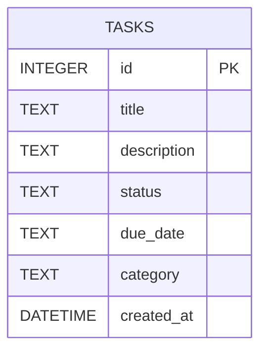

# 任務管理系統 - 資料庫設計 (DB Design)

本文件定義系統的 SQLite 資料庫結構，包含 ER 圖、資料表詳細說明，以及對應的 Python Model 實作。

## 1. ER 圖（實體關係圖）

目前系統為 MVP 階段，採用單一 `tasks` 資料表來儲存任務的主要資訊，並利用 `category` 欄位來記錄分類或標籤，以維持架構輕量。



## 2. 資料表詳細說明

### 資料表名稱：`tasks`

此資料表負責儲存所有的任務資料。

| 欄位名稱 | 型別 | 必填 | 預設值 | 說明 |
| :--- | :--- | :--- | :--- | :--- |
| `id` | INTEGER | 是 | (AUTOINCREMENT) | 唯一識別碼 (Primary Key) |
| `title` | TEXT | 是 | 無 | 任務標題 |
| `description` | TEXT | 否 | NULL | 任務詳細描述 |
| `status` | TEXT | 是 | `'pending'` | 任務狀態（`pending` 待處理、`in_progress` 進行中、`completed` 已完成） |
| `due_date` | TEXT | 否 | NULL | 任務到期日（ISO 8601 格式，如 `YYYY-MM-DD`） |
| `category` | TEXT | 否 | NULL | 任務分類或標籤 |
| `created_at` | DATETIME | 是 | `CURRENT_TIMESTAMP` | 資料建立時間 |

## 3. SQL 建表語法

建表語法儲存於 `database/schema.sql`，未來可透過此檔案快速初始化資料庫。

```sql
CREATE TABLE IF NOT EXISTS tasks (
    id INTEGER PRIMARY KEY AUTOINCREMENT,
    title TEXT NOT NULL,
    description TEXT,
    status TEXT NOT NULL DEFAULT 'pending',
    due_date TEXT,
    category TEXT,
    created_at DATETIME DEFAULT CURRENT_TIMESTAMP
);
```

## 4. Python Model 程式碼

系統選用內建的 `sqlite3` 模組來實作資料庫操作。Model 程式碼位於 `app/models/task.py`，提供完整的 CRUD 方法：
- `create(...)`：新增任務
- `get_all()`：取得所有任務
- `get_by_id(task_id)`：取得單筆任務
- `update(task_id, ...)`：更新任務資料
- `delete(task_id)`：刪除任務
