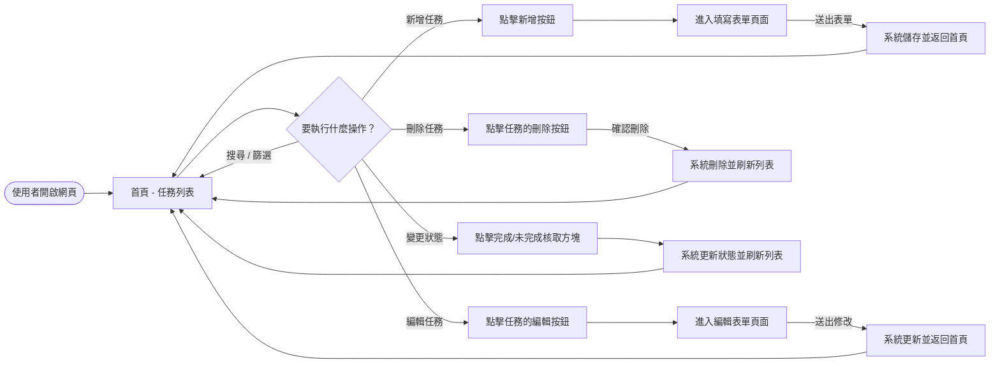
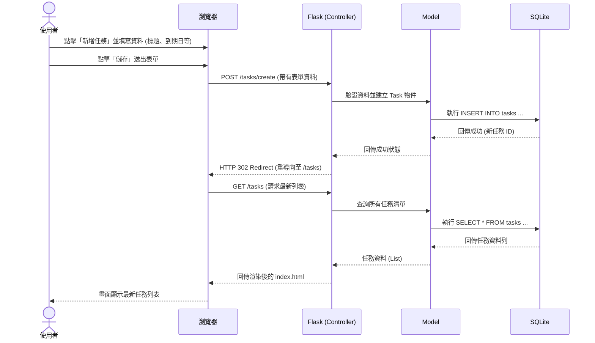

# 任務管理系統 - 流程圖 (Flowchart)

本文件根據 PRD 與系統架構文件，視覺化使用者操作路徑與系統資料流，幫助開發團隊釐清各功能之間的切換與資料處理順序。

## 1. 使用者流程圖（User Flow）

描述使用者進入系統後，可以進行的各種操作與頁面跳轉。

## 2. 系統序列圖（Sequence Diagram）

以下序列圖描述「使用者新增一筆任務」時，瀏覽器、Flask 後端與資料庫之間的完整互動流程。

## 3. 功能清單對照表

以下整理出本系統的所有主要功能與對應的路由設計 (URL Path 與 HTTP Method)：

| 功能描述 | URL 路徑 | HTTP 方法 | 負責頁面/動作 |
| :--- | :--- | :--- | :--- |
| **檢視任務清單** (首頁，包含搜尋、篩選) | `/` 或 `/tasks` | GET | 渲染 `index.html`，顯示任務列表 |
| **新增任務頁面** (顯示表單) | `/tasks/create` | GET | 渲染 `task_form.html` (空白表單) |
| **新增任務動作** (接收資料) | `/tasks/create` | POST | 處理資料並儲存至資料庫，重導回首頁 |
| **編輯任務頁面** (顯示既有資料) | `/tasks/<id>/edit` | GET | 渲染 `task_form.html` (帶有原資料) |
| **編輯任務動作** (更新資料) | `/tasks/<id>/edit` | POST | 更新資料庫該筆資料，重導回首頁 |
| **刪除任務** | `/tasks/<id>/delete` | POST | 從資料庫刪除指定任務，重導回首頁 |
| **標記完成/未完成狀態** | `/tasks/<id>/status` | POST | 更新任務狀態欄位，重導回首頁 |

> 註：由於沒有使用前後端分離，刪除與狀態更新功能目前規劃透過前端表單 (form) 送出 POST 請求來實現。
